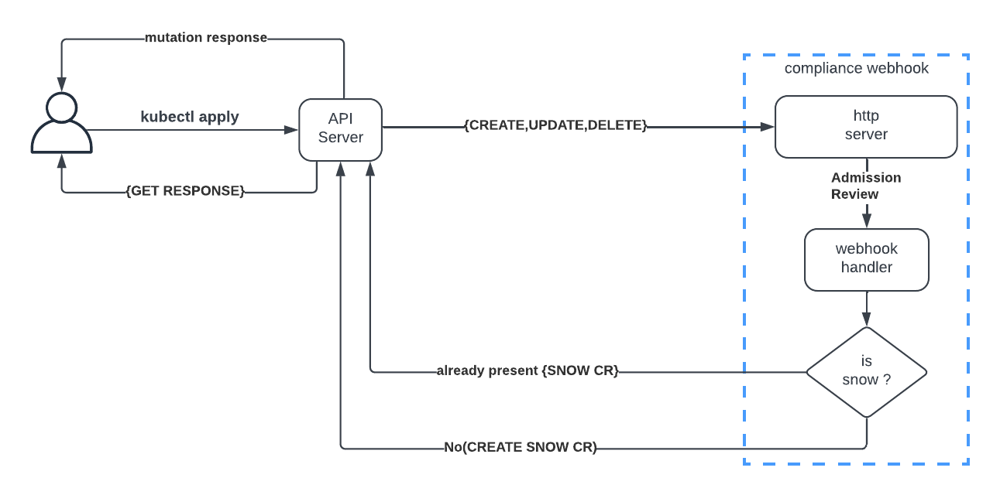
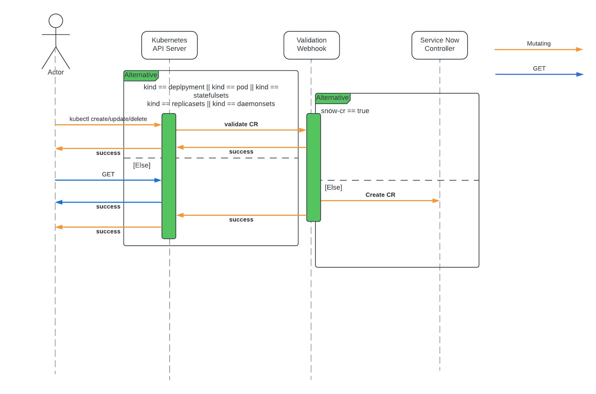
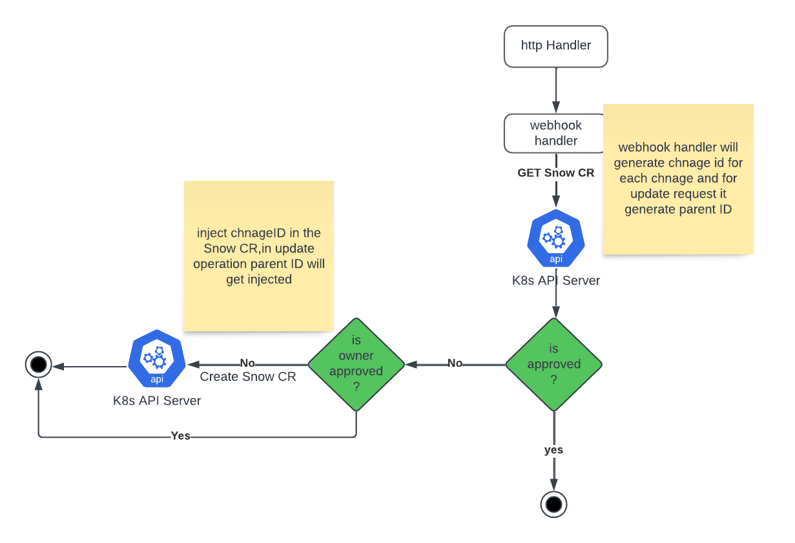

# Compliance Webhook

## Preamble
A kubernetes validating webhook server which helps to maintain the audit history of mutating operations like create,update and delete
on the cluster with respect to kubernetes objects like deployemnts,replicasets,statefulsets,pods or demonsets.
This way we can track the manual changes made to the cluster using kubectl.

## Goals

Record any create update and delete operation using deployments,pods,statefulsets and replicasets
Create Service Now CR for each operation,which can be audited later

** Reject any unapproved request

## High Level Design


The validation webhook server (compliance-webhook) will only process [CREATE,UPDATE,DELETE] requests for deployemnts,replicasets,statefulsets,pods or demonsets.
it will check if the corresponding service now request is available else it will create a new service now request.

As described in the below sequence diagram.



### webhook-server flow




### Validation Webhook

Validating admission webhooks are used to validate objects sent to the Kubernetes API server. They cannot modify objects; they can only accept or reject them based on some criteria.
Use Cases:
    Enforcing policies.

    Validating configuration settings.

    Ensuring security compliance

```yaml
   apiVersion: admissionregistration.k8s.io/v1
   kind: ValidatingWebhookConfiguration
   metadata:
     name: cluster-compliance
     labels:
       app.kubernetes.io/managed-by: Helm
   webhooks:
     - name: deployment.mutation.svc
       clientConfig:
         service:
           namespace: kube-system
           name: webhook-server
           path: /validate
           port: 443
         caBundle:
       rules:
         - operations:
             - CREATE
             - DELETE
             - UPDATE
           apiGroups:
             - apps
             - batch
           apiVersions:
             - v1
           resources:
             - pods
             - deployments
             - replicasets
             - jobs
             - statefulsets
           scope: Namespaced
       failurePolicy: Fail
       matchPolicy: Equivalent
       sideEffects: None
       timeoutSeconds: 5
       admissionReviewVersions:
         - v1
         - v1beta1

```

## Install Webhook

### Prerequisites

configured kubectl should be on path
service account to access snow cr
update the docker image $(TAG) in the makefile

```shell
make helm-uninstall
make helm-install
```

## Future Goals

Audit report to generate by a controller

Track operation based create,update and delete

we can leverage audit sink webhook for 

```yaml
 apiVersion: auditregistration.k8s.io/v1alpha1
 kind: AuditSink
 metadata:
   name: compliance-audit-sink
 spec:
   webhook:
     throttle:
       qps: 10
       burst: 15
     clientConfig:
       service:
         name: audit-webhook-service
         namespace: webhook-namespace
         path: /audit
       caBundle: <base64-encoded-CA-cert>
     rules:
       - level: Metadata
```