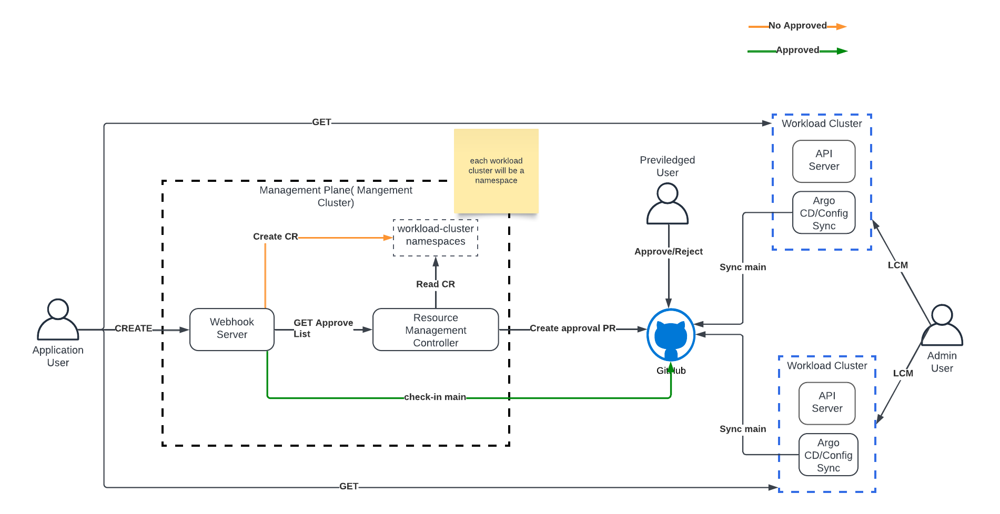

# Compliance Webhook

## Preamble
A kubernetes validating webhook server which helps to maintain the audit history of mutating operations like create,update and delete
on the cluster with respect to kubernetes objects like deployemnts,replicasets,statefulsets,pods or demonsets.
This way we can track the manual changes made to the cluster using kubectl.

## Goals

Record any create update and delete operation using deployments,pods,statefulsets and replicasets
Create Service Now CR for each operation,which can be audited later

** Reject any unapproved request

## High Level Design


The validation webhook server (compliance-webhook) will only process [CREATE,UPDATE,DELETE] requests for deployemnts,replicasets,statefulsets,pods or demonsets.
it will check if the corresponding service now request is available else it will create a new service now request.

As described in the below sequence diagram.


### webhook-server flow


### Validation Webhook

Validating admission webhooks are used to validate objects sent to the Kubernetes API server. They cannot modify objects; they can only accept or reject them based on some criteria.
Use Cases:
Enforcing policies.

Validating configuration settings.

Ensuring security compliance

```yaml
   apiVersion: admissionregistration.k8s.io/v1
   kind: ValidatingWebhookConfiguration
   metadata:
     name: cluster-compliance
     labels:
       app.kubernetes.io/managed-by: Helm
   webhooks:
     - name: deployment.mutation.svc
       clientConfig:
         service:
           namespace: kube-system
           name: webhook-server
           path: /validate
           port: 443
         caBundle:
       rules:
         - operations:
             - CREATE
             - DELETE
             - UPDATE
           apiGroups:
             - apps
             - batch
           apiVersions:
             - v1
           resources:
             - pods
             - deployments
             - replicasets
             - jobs
             - statefulsets
           scope: Namespaced
       failurePolicy: Fail
       matchPolicy: Equivalent
       sideEffects: None
       timeoutSeconds: 5
       admissionReviewVersions:
         - v1
         - v1beta1

```

## Install Webhook

### Prerequisites

configured kubectl should be on path
service account to access snow cr
update the docker image $(TAG) in the makefile

```shell
make helm-uninstall
make helm-install
```

# Future Goals

Audit report to generate by a controller

Track operation based create,update and delete

we can leverage audit sink webhook

```yaml
 apiVersion: auditregistration.k8s.io/v1alpha1
 kind: AuditSink
 metadata:
   name: compliance-audit-sink
 spec:
   webhook:
     throttle:
       qps: 10
       burst: 15
     clientConfig:
       service:
         name: audit-webhook-service
         namespace: webhook-namespace
         path: /audit
       caBundle: <base64-encoded-CA-cert>
     rules:
       - level: Metadata
```

## Management Plane and GitOps based Architecture

In this architecture there will be a management plane/cluster which will manage the lifecycle of apps in the workload cluster using GitOps.



#### Application User

General user who wants to deploy apps to the workload cluster

#### Webhook Server

This will be a validating webhook server which will intercept all the mutating operations to the workload cluster,if a resource have an approval
webhook server will push the spec to the github main branch,which later will be synced to the workload cluster,otherwise it will 
approval CR later resource management controller will publish the same to GitHub for necessary approval.

#### Resource Management Controller

This controller will reconcile on unapproved CR's created by the Webhook Server and will create necessary Git PR for approval,also this controller
will publish the approval list to another CR which webhook server will consume for validation.

#### Workload Cluster Namespaces

Each workload cluster will be a namespace in the management cluster so all the resources for a corresponding workload cluster can reside in that namespace.

#### GitHub

GitHub will be used for the approval process, and also it will help to maintain change list executed on each cluster,for better isolation
each workload cluster can be a repo/project in github.

#### Workload Cluster

Target cluster where the business application will be running.

#### ConfigSync or ArgoCD

These operators will sync the approved spec from the main/release branch and will keep the state of the apps synced with Git.

## Pros and Cons

### Pros

 workload cluster will always have the approved resources.
 no additional Webhook overhead in the workload cluster.
 we don't need to manage resource management controllers in the workload cluster.
 restricted mutation access to the cluster.
 workload cluster's don't have to maintain the audit history.
 GitHub will easily help to manage the versioning and change log of the reosurces.
 

### Cons

  A management plane need to be introduced which might add additional infra cost and maintenance.
  If number of workload clusters are more then the management plane need to scaled horizontally.


    
 